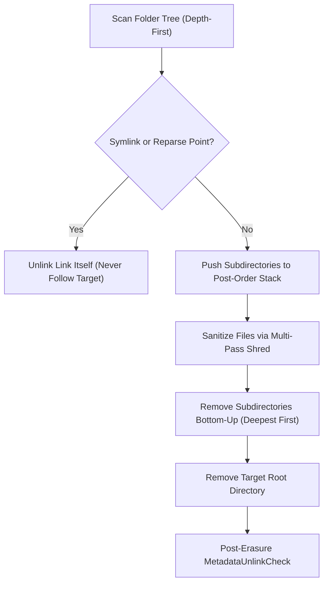

# LocardX Secure File & Folder Eraser (Pillar 2)
## Architecture, Threat Model, Physical Limitations & Verification Engine

---

## 1. Overview & Operational Scope

LocardX Pillar 2 provides surgical, non-destructive to the physical drive, file- and directory-level sanitization. Unlike physical drive erasure (Pillar 1) which targets low-level LBA ranges or firmware sanitization commands across entire storage devices, the File & Folder Eraser operates strictly within the **logical filesystem layer**.

### Core Operational Boundaries
- **Supported Targets**: Individual regular files and recursive directory hierarchies located on mounted volumes.
- **Physical Drive & Partition Exclusion**: Physical drive erasure (`DriveErasure`) and partition formatting remain strictly disabled and fail-closed.
- **Forensic Recovery Scope**: Carving and recovery (`Recovery`) remain unexecutable.
- **Execution Mechanism**: Strict Rust `std::fs` streaming APIs operating in bounded 64 KB memory chunks. Zero invocation of external shell interpreters (`cmd.exe`, `powershell.exe`) or shell utilities (`del`, `rd`, `cipher`, `format`, `diskpart`).

---

## 2. Threat Model & Physical Storage Realities

Logical sanitization operates by opening a file descriptor, seeking across the file's addressable bytes, writing structured overwrite patterns, flushing operating system write caches, and unlinking the directory index entry. In modern forensic science, operators must recognize that logical erasure has distinct physical limitations compared to raw physical block destruction.

### A. Flash Translation Layer (FTL) & Wear Leveling (SSDs / NVMe / eMMC)
Solid-state drives employ an internal controller running proprietary FTL firmware. Flash memory cells cannot be overwritten in-place; blocks must be erased in large erase blocks before being rewritten in page increments. 
- To maximize drive longevity, the FTL remaps logical block addresses (LBAs) across wear-leveled physical flash pages.
- When an application writes overwrite patterns to logical file offsets, the SSD controller frequently allocates new, clean physical pages and marks the prior physical pages as "dirty" / obsolete.
- Until the SSD's background garbage collector triggers an erase cycle or an explicit TRIM / Deallocate command is executed, the original data fragments may temporarily remain readable in physical flash cells accessible via forensic chip-off analysis or hardware diagnostic ports.

### B. Filesystem Journaling & Metadata Remnants
Modern journaling filesystems (NTFS USN journal, `$LogFile`, `$MFT`, ext3/ext4 journal, XFS log) log transactional metadata:
- While file data clusters are overwritten and truncated, filename strings, security descriptors, timestamp sequences, and cluster run allocations may remain recorded in historical journal transactions or unallocated `$MFT` record slack.
- LocardX performs temporary UUID filename scrambling prior to deletion to minimize directory index filename retention, but underlying transactional logs are outside userland logical scope.

### C. Volume Shadow Copies (VSS) & Automated Backups
On Windows operating systems, the Volume Snapshot Service (VSS) creates differential block-level snapshots of logical volumes:
- Modifying or unlinking a file on the active filesystem does not delete historical copies retained inside frozen Volume Shadow Copies.
- Administrative intervention or dedicated volume-level snapshot purging is required to destroy VSS copies.

### D. Copy-on-Write (CoW) Filesystems
On Copy-on-Write filesystems (Btrfs, ZFS, APFS, Windows ReFS):
- An overwrite to an existing block writes the new data to an entirely fresh disk allocation and updates metadata pointers.
- The original disk blocks remain untouched until explicitly reclaimed or overwritten by subsequent volume writes.

---

## 3. Sanitization Overwrite Algorithms

LocardX implements two high-assurance logical sanitization routines:

### 1. Logical File Shred (Multi-Pass Overwrite — Recommended)
- **Pass 1 (Cryptographic PRNG)**: Overwrites the file stream with pseudorandom bytes generated by `rand::rngs::OsRng`, destroying existing bit orientations and character frequencies.
- **Pass 2 (Bit Inversion — 0x55)**: Overwrites the file stream with alternating bit pattern `01010101` (`0x55`), inducing state transitions across storage cells.
- **Pass 3 (Zeroization — 0x00)**: Overwrites the file stream with fixed null bytes (`0x00`), bringing the logical allocation to a deterministic cleared baseline.
- **Synchronization**: Executes `File::sync_all()` after each pass to flush OS file system buffers and drive controller write caches.
- **Truncation & Name Scrambling**: Truncates file length to 0 bytes (`set_len(0)`), renames the file to a randomized UUID temporary name in the same parent directory to eliminate namespace residue, and unlinks via `std::fs::remove_file`.

### 2. NIST SP 800-88 Rev 1 Clear (Single-Pass Zero Overwrite)
- **Pass 1 (Deterministic Null Bytes)**: Overwrites the logical addressable length with `0x00`.
- **Synchronization & Removal**: Executes `File::sync_all()`, truncates length to 0, scrambles filename to UUID, and unlinks.

---

## 4. Recursive Folder Sanitization Protocol

Recursive folder sanitization securely removes arbitrary directory trees while enforcing strict boundary safety:

### Safety Rules During Traversal
1. **No Reparse Point / Symlink Traversal**: Symbolic links, junctions, and reparse points are unlinked directly without following target pointers, preventing directory escape attacks into system directories or other mounted volumes.
2. **Read-Only Attribute Removal**: Automatically clears read-only filesystem attributes on files and folders before attempting overwrite or unlinking.
3. **Partial Failure Resilience**: If a file within a folder is locked by an external process or permission-denied, the engine logs the item to `FolderEraseStats.failures`, increments `files_failed`, and proceeds to sanitize all remaining items.
4. **Bottom-Up Directory Removal**: Directories are unlinked in reverse order of depth (longest path first) only after all child files have been processed.

---

## 5. Two-Stage Authorization & TOCTOU Defense

Every file and folder erasure operation is protected by the `SafetyEngine` state machine:

### Stage 1: Planning & Challenge Creation
- Validates the target path is non-empty, exists, is not a symbolic link, and is **not an OS root or Windows system directory** (`C:\Windows`, `C:\Program Files`, `C:\pagefile.sys`, `C:\bootmgr`, `/boot`, `/etc`).
- Computes pre-erasure metadata snapshot: canonical path, file size, timestamps, and SHA-256 hash (for single files).
- Issues an operator-bound, single-use `ConfirmationChallenge` with a 5-minute TTL.

### Stage 2: TOCTOU Verification & Commit
- Operator must provide a valid session token, explicitly check the warning acknowledgement, and type the exact target path.
- **Live Re-Probe (Time-of-Check to Time-of-Use Defense)**: Immediately before opening the target for destructive write, `verify_target_snapshot_integrity` re-probes disk metadata:
  - Verifies target still exists.
  - Verifies target was not substituted with a symbolic link or junction.
  - Verifies target type (`is_dir`) matches original plan.
  - Verifies target file size matches original snapshot.
- If any discrepancy is detected, execution aborts immediately with `SecurityViolation`, the confirmation challenge is revoked, and a `FILE_ERASURE_FAILED` audit event is logged.

---

## 6. Post-Sanitization Verification Engine

Following file or folder sanitization, the `FileVerifier` evaluates the filesystem state:
- **Strategy**: `MetadataUnlinkCheck`.
- **Inaccessibility Verification**: Tests `Path::exists()` and verifies `std::fs::metadata(path)` returns `NotFound`.
- **Outcome Assessment**:
  - `Verified`: Path is completely inaccessible and directory entries removed.
  - `VerificationFailed`: File or directory remains accessible on filesystem.
  - `UnableToVerify`: Target was modified or replaced by external process during unlinking.
- **Audit Preservation**: All outcomes, pre-erasure SHA-256 digests, bytes processed, and physical limitations disclaimers are written to SQLite and appended to the cryptographic SHA-256 tamper-evident hash chain.
