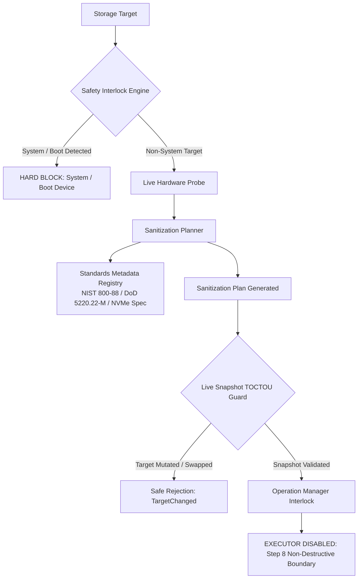

# LocardX Sanitization Architecture & Verification Engine

## 1. Architectural Overview

LocardX establishes a production-grade, fail-closed sanitization planning and post-erasure verification architecture.

The sanitization pipeline is decoupled into four distinct, non-overlapping concerns:
1. **Safety & Authorization Interlock Layer (`locardx-security`)**: Sole authority for determining whether an operation is permitted. Prevents targeting active system and boot volumes.
2. **Deterministic Sanitization Planner (`locardx-verification::sanitization::planner`)**: Evaluates media category, geometry, and standards compliance to recommend optimal methods and verification strategies.
3. **Hardware Snapshot & TOCTOU Guard (`locardx-verification::sanitization::snapshot`)**: Binds sanitization plans to live hardware fingerprints, detecting device replacement or geometric alteration before execution.
4. **Post-Erasure Verification Architecture (`locardx-verification`)**: Structured verification models distinguishing what was sanitized from what was actually verified, complete with documented technical limitations.

---

## 2. Media-Aware Method Selection Philosophy

One erasure method does **not** work for every media category.

### 2.1 Magnetic Rotational Media (HDD)
- **Physics**: Magnetic domains on rotating platters.
- **Recommended Method**: Single-pass zero overwrite (**NIST SP 800-88 Rev. 1 Clear**) or 3-pass overwrite (**DoD 5220.22-M**).
- **Effectiveness**: Software sector overwrite directly writes to the underlying magnetic track.
- **Verification**: 100% full sequential read-back or pseudo-random statistical sector sampling (10% LBA).

### 2.2 Solid State Flash Media (SSD & NVMe SSD)
- **Physics**: NAND flash memory managed by a Flash Translation Layer (FTL).
- **The FTL Problem**:
  - Logical Block Addresses (LBAs) do not have a fixed 1-to-1 physical mapping to NAND flash cells.
  - Wear leveling, garbage collection, and over-provisioning (typically 7–28% extra hidden storage) mean logical sector overwriting **cannot guarantee physical erasure of all retired or unmapped flash blocks**.
  - Software multi-pass overwrites (such as DoD 5220.22-M) inflict severe, unnecessary write amplification and accelerate drive wear-out without increasing security over single-pass purge.
- **Recommended Method**:
  - **NVMe SSD**: NVMe Format Cryptographic Erase (`SES=2`) or NVMe Sanitize Block Erase.
  - **SATA SSD**: ATA Firmware Secure Erase / Sanitize command, or NIST SP 800-88 Rev. 1 Purge (Cryptographic Erase).
- **Verification Strategy**: Controller Cryptographic Key Destruction Verification or FTL deallocation verification.

### 2.3 Removable Media & Memory Cards (USB / SD / MMC)
- **Physics**: Consumer-grade flash microcontrollers with primitive wear leveling.
- **Recommended Method**: Block-level zero overwrite (`BlockZeroOverwrite` / NIST 800-88 Clear).
- **Limitations**: Inexpensive USB flash controllers cannot be controlled via firmware sanitize commands. Multi-pass overwrite risks permanent device bricking.

### 2.4 Logical Scopes (Files & Folders)
- **Recommended Method**: LocardX Logical File Shred (`LogicalFileShred`): Multi-pass payload overwrite, cache flushing, truncation to 0 bytes, filename scrambling, and directory unlinking.
- **Limitations**:
  - Filesystem journaling ($LogFile in NTFS, ext4 journal) can retain metadata and small resident file remnants.
  - Volume Shadow Copies (VSS) and system restore points retain previous versions unless specifically deleted.
  - Copy-on-Write (CoW) filesystems (ReFS, APFS, Btrfs) allocate new blocks on write rather than in-place overwriting.

---

## 3. Post-Erasure Verification Architecture

### 3.1 Verification Outcomes
- **`Verified`**: Erased state confirmed across the declared verification strategy.
- **`VerificationFailed`**: Non-zero or unexpected remnant bytes detected during sample/full read-back.
- **`PartiallyVerified`**: Verified across user-addressable LBAs, but hidden over-provisioned or reallocated areas are unverified due to hardware opacity.
- **`UnableToVerify`**: Target device was disconnected, dismounted, or returned I/O errors during verification.
- **`NotApplicable`**: Dry-run planning or non-destructive simulation.

### 3.2 Verification Honesty & Anti-Marketing Rule
LocardX strictly forbids claiming:
- *"100% secure"*
- *"Military-grade erasure"*
- *"Impossible to recover"*

The verification engine explicitly reports **what was sanitized** separately from **what was verified**, and lists all applicable technical limitations directly on the certificate/report.

---

## 4. Why Destructive Execution is Disabled in Step 8

Step 8 establishes:
- The domain models and planning contracts.
- Standards mapping and verification requirements.
- TOCTOU target snapshot validation.
- Database persistence and audit hash-chain logging.
- Workstation dry-run UI.

All destructive executors (`FileErasure`, `FolderErasure`, `DriveErasure`, and `Recovery`) **remain disabled and fail closed** until Steps 9 and 10 implement the low-level Windows volume locking, unmounting, sector write streaming, and firmware command dispatchers.
